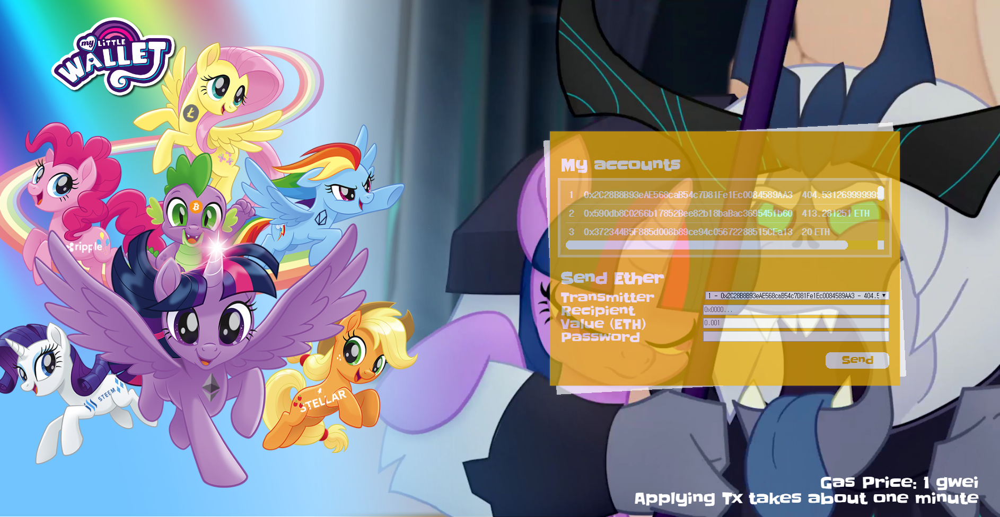

# 

> Friendship is Magic!

## What is this?
An simple remote ethereum wallet implementation

## Features
+ You can see our love, ***Twilight***.  
+ Live-updated accounts list and balances with highlighting changes.  
+ Send ether to other account.  

## Installation
### Requirements
+ **geth** with IPC
+ **node.js** v10 or higher

### Step-by-Step Instruction
1. **Clone this repository**  
    ```sh
    git clone https://github.com/yuoa/MyLittleWallet.git
    cd MyLittleWallet
    ```
2. **Install npm packages**  
    If you have installed `yarn`, install with `yarn`.
    ```sh
    yarn install
    ```
    You can do this with `npm`.
    ```sh
    npm i
    ```
3. **Launch `geth`**  
    Before run *mlw*, run your `geth` and copy your `geth.ipc` path.  
4. **Run `mlw`**  
    Run *MyLittleWallet*.  
    ```sh
    ./mlw -i ~/.ethereum/geth.ipc
    ```

## How to use
After installation and running `mlw`, you can enter `localhost:8000` on your browser to see this wallet.  
You can use other webserver with proxying.  
Also, you can change the port with `--port` or `-p` option.  
```sh
./mlw -i ~/.ethereum/geth.ipc -p 8080
```

## Screenshot


## Motivations
+ https://pjreddie.com/resume/  
+ http://www.mylittlepony.movie  
